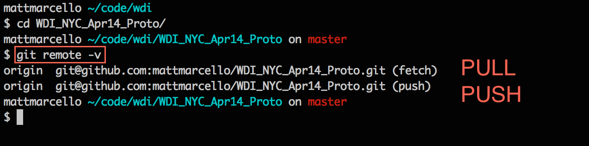
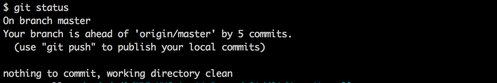

# To do once...
## Fork our repository
* Make your own copy of the class repository.  


## Set up remotes on your machine.
* Copy the ssh clone url on your fork of the repository.


* Clone your fork of the repository down to your local machine.


* Have a look at your remotes with ```bash git remote -v```: 


* Copy the ssh clone url of the class repository.


* Set the class repository as an upstream remote on your local machine.


# To do on a many times daily basis...
## Get materials from the class repository
* ```bash git pull upstream master``` will pull in files from the class repository, which is set as your `upstream` remote.


## Do your work.
* Do your work.


* Tell GIT to track your files. 


* Tell GIT to take a snapshot of your working code. 


* ```bash git status``` shows the state of your code base.  Here you will see that there are no additional changes to commit.


## Submit your work.

* Push your work to YOUR fork of the class repository, set is your `origin` remote.


* Make a `pull request`	


* Title your pull request in the following format `hw_w01_d01_submission`.  Rate the assignment's completeness and your comfortability with it. 


* Celebrate. 


